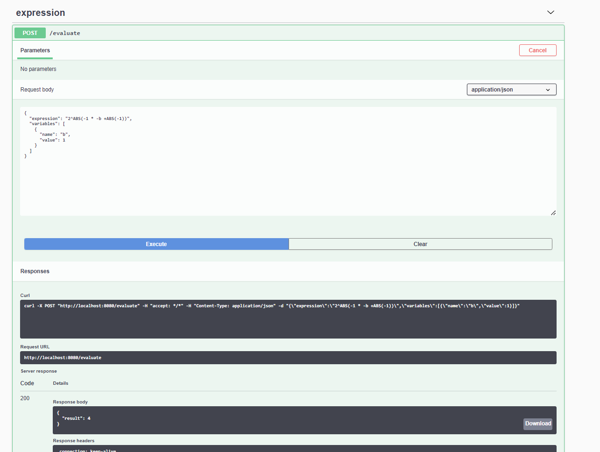

## Algebraic API V 0.1

This app allows parsing of simple algebraic expressions. Parsing is done by antlr4 grammar which vas modified to allow
usage of `ABS(...) ` unary operator, also ensures commutativity and correct associativity of expression and correct way
to declare negative constants and variables (which is difference from original). Modified grammar can be found
here `src/main/antlr4/Polynomial.g4` and originally was taken from here:

[Davide Lettieri: polynomial grammar](https://davidelettieri.it/c%23/antlr/polynomial/2017/12/25/antlr-polynomial.html)

### Available operators

Standard set of mathematical opertors:`+`, `-`, `/`, `*`, `()`, `^`
Special unary operators: `ABS(...)` absolute vlaues, `LEN('abcd')` and len of string in parameter Its possible to use
varibles but they have to be single letter lower case: `a+b+c`

Functionality is delivered as spring boot server less app to run it please use:

* on windows: `mvnw.cmd spring-boot:run`
* on linux: `./mvnw spring-boot:run`

This requires some java runtime to be installed and existence of `JAVA_HOME` environment property.

Then
access [http://localhost:8080/swagger-ui.html](http://localhost:8080/swagger-ui/index.html?configUrl=/v3/api-docs/swagger-config#/expression/newEmployee)
where you can test the endpoint

